# Backend Process Flow - Sequence Diagram

This diagram shows the complete process flow of the backend simulation engine, from job creation to simulation execution and completion.

## Mermaid Sequence Diagram

```mermaid
sequenceDiagram
    participant F as Frontend
    participant API as FastAPI Main
    participant JS as JobService
    participant DB as SimulationDatabase
    participant SM as SM Server
    participant TC as TC Server
    participant BG as Background Task

    Note over F, BG: Job Creation & Initialization
    F->>API: POST /jobs/create (JobsCreationRequest)
    API->>API: Reset job_creation_status
    API->>JS: Initialize JobService
    API->>BG: Add background task (create_jobs_and_update_status)
    API->>F: Return "Job creation started"
    
    Note over F, BG: Background Simulation Execution
    BG->>JS: Start create_jobs()
    JS->>JS: Set simulation_start_time
    JS->>DB: Update simulation run start timestamp
    JS->>DB: Log "Simulation starts"
    
    JS->>JS: Create Station objects from request
    JS->>JS: Create StationGroup objects
    JS->>JS: Parse duration_string into operations list
    JS->>JS: Initialize simulation variables:<br/>- advance_orders (inbound/outbound)<br/>- operation tracking<br/>- check intervals
    
    Note over F, BG: Main Simulation Loop
    loop Until stop_requested OR duration_reached
        JS->>JS: Get current operation (AO/N) and index
        
        alt Current Operation: Advance Order (AO)
            JS->>DB: Log "Advance order starts"
            JS->>JS: Calculate remaining duration
            JS->>JS: Calculate number of orders needed
            JS->>JS: Create advance orders with random bins
            
            loop For each advance order
                JS->>SM: POST /v3/advanced-orders/upsert
                JS->>DB: Log advance order submission
            end
            
            JS->>JS: Update advance_orders dictionaries
            JS->>DB: Log "Advance order ends in X seconds"
            
        else Current Operation: Normal (N) OR orders incomplete
            alt First loop of normal operation
                JS->>DB: Log "Normal operation starts"
            end
            
            loop For each station group
                alt All stations in group empty AND normal operation
                    alt Advance orders available
                        JS->>JS: Get first advance order
                        JS->>JS: Distribute bins equally among stations
                        JS->>JS: Remove advance order from queue
                    else No advance orders
                        JS->>JS: Calculate bins needed per station
                        JS->>JS: Get bins from matrix using Pareto distribution
                    end
                    
                    loop For each station in group
                        JS->>SM: POST /v3/operations/call (call bins to station)
                        JS->>DB: Log bins called
                    end
                end
                
                loop For each station in group
                    JS->>SM: GET /v3/storages?stations={code} (check status)
                    
                    alt Bin at station AND time >= next_job_time
                        JS->>SM: POST /v3/operations/store (store bin back)
                        JS->>DB: Log "Bin stored"
                        JS->>JS: Update station.next_job_time (add delay)
                        JS->>JS: Remove bin from station.bins list
                    end
                end
            end
            
            JS->>JS: Check if all orders completed
            alt All orders completed
                JS->>DB: Log "All orders completed beyond normal operation"
            end
            
            alt Normal operation time exceeded
                JS->>DB: Log "Normal operation ends. Completing remaining bins"
                JS->>JS: Set is_normal_operation_ending = true
            end
        end
        
        JS->>JS: Sleep 0.5 seconds (avoid busy-waiting)
    end
    
    Note over F, BG: Simulation Completion
    JS->>JS: Set simulation_end_time
    JS->>DB: Log "Simulation ends"
    JS->>DB: Update simulation run end timestamp
    JS->>DB: Close database connection
    JS->>TC: POST /operation/cyclestop (stop TC)

    Note over F, BG: Status Monitoring (Parallel)
    loop Monitoring (parallel to simulation)
        F->>API: GET /status
        API->>F: Return job_creation_status
        
        opt Stop requested
            F->>API: POST /jobs/stop
            API->>API: Set stop_requested = true
            API->>F: Return "Job creation stopped"
        end
        
        opt Health check
            F->>API: GET /time
            API->>F: Return current timestamp
        end
    end

    Note over F, BG: Bin Management Subroutines
    
    rect rgb(240, 248, 255)
        Note over JS, SM: Get Bins From Order Subroutine
        JS->>JS: Use Pareto probabilities as weights
        JS->>JS: Sample layer indices randomly
        loop For each layer with bins needed
            JS->>SM: GET /v3/storages/layer (get bins from layer)
            JS->>JS: Randomly sample required quantity
        end
        JS->>JS: Ensure unique bin codes
        JS->>JS: Return unique_bins list
    end
    
    rect rgb(255, 248, 240)
        Note over JS, SM: Get Bins From Layers Subroutine
        JS->>SM: GET /v3/storages/layer?minLayer={min}&maxLayer={max}
        SM->>JS: Return bins data or empty if unavailable
    end
    
    rect rgb(248, 255, 248)
        Note over JS, SM: Check Station Status Subroutine
        JS->>SM: GET /v3/storages?stations={code}
        SM->>JS: Return list of bins at station/gateway
    end

    Note over F, BG: Error Handling & Logging
    
    alt Database operations fail
        DB->>JS: SQLAlchemyError
        JS->>JS: Print error and rollback
    end
    
    alt SM/TC requests fail
        SM->>JS: RequestException
        JS->>JS: Print error and raise exception
    end
    
    alt No bins available after retries
        JS->>JS: Raise SimulationBackendException
        JS->>DB: Log error message
    end
```

## Process Overview

The backend operates as a FastAPI application that orchestrates complex warehouse simulation scenarios:

### 1. Job Creation & Initialization
- Receives job creation requests from frontend
- Initializes JobService with simulation parameters
- Sets up background task execution
- Resets global status tracking

### 2. Simulation Setup
- Creates Station and StationGroup objects
- Parses operation durations (Normal/Advance Order)
- Initializes tracking variables and timers
- Establishes database connections and logging

### 3. Main Simulation Loop
The core simulation runs in two operation modes:

#### Advance Order (AO) Operations:
- Pre-calculates required orders for remaining duration
- Creates advance orders with randomly distributed bins
- Submits orders to SM server for pre-positioning
- Tracks advance order completion

#### Normal (N) Operations:
- Distributes bins to stations (from advance orders or fresh bins)
- Calls bins from matrix to stations via SM
- Monitors station status for bin arrivals
- Stores completed bins back to matrix
- Manages operator handling time delays

### 4. Bin Management
- Uses Pareto distribution for realistic bin placement
- Implements retry logic for bin availability
- Ensures unique bin assignments
- Handles layer-based bin retrieval

### 5. Status Monitoring
- Provides real-time status via REST endpoints
- Supports simulation stopping via API
- Tracks simulation progress and timing
- Logs all significant events to database

### 6. Completion & Cleanup
- Stops TC operations gracefully
- Updates final timestamps
- Closes database connections
- Provides completion status

## Key Components

### FastAPI Application (`main.py`)
- **Endpoints**: `/jobs/create`, `/jobs/stop`, `/status`, `/time`
- **Background Tasks**: Asynchronous simulation execution
- **Status Tracking**: Global job creation status

### JobService (`job_service.py`)
- **Core Logic**: Main simulation orchestration
- **Station Management**: Station and group coordination
- **Operation Modes**: Advance Order vs Normal operations
- **Bin Distribution**: Pareto-based bin assignment
- **External Communication**: SM/TC server integration

### Data Models (`job_request.py`)
- **JobsCreationRequest**: Complete simulation configuration
- **Station/StationGroup**: Warehouse layout definitions
- **Parameters**: Simulation timing and quantities
- **Configuration**: Duration and server settings

### Database Layer (`simulation_database.py`)
- **SimulationRun**: Simulation metadata and timing
- **Log**: Detailed event logging with timestamps
- **Operations**: CRUD operations with error handling
- **Connection Management**: PostgreSQL integration

## External System Integration

### SM Server (Storage Manager)
- **Bin Operations**: Call, store, and query bin locations
- **Advanced Orders**: Pre-order management
- **Station Status**: Real-time bin positioning
- **Layer Management**: Bin retrieval by storage layers

### TC Server (Traffic Controller)  
- **Cycle Control**: Start/stop traffic operations
- **Movement Coordination**: Skycar traffic management
- **System Integration**: Coordinated shutdown procedures

### Database Systems
- **PostgreSQL**: Simulation metadata and logs
- **MongoDB**: Movement data (via TC integration)
- **Session Management**: Connection pooling and cleanup

## Operation Characteristics

### Timing & Scheduling
- **Real-time Execution**: Actual time-based simulation
- **Operator Delays**: Configurable handling times
- **Check Intervals**: 1-second monitoring cycles
- **Sleep Management**: 0.5-second loop delays

### Distribution Logic
- **Pareto Distribution**: Realistic bin placement patterns
- **Random Sampling**: Statistical bin selection
- **Layer Stratification**: Height-based storage logic
- **Equal Distribution**: Fair station load balancing

### Error Handling
- **Retry Mechanisms**: Bin availability retries (max 20)
- **Exception Management**: Custom simulation exceptions
- **Request Failures**: Network error handling
- **Data Validation**: Input parameter validation
