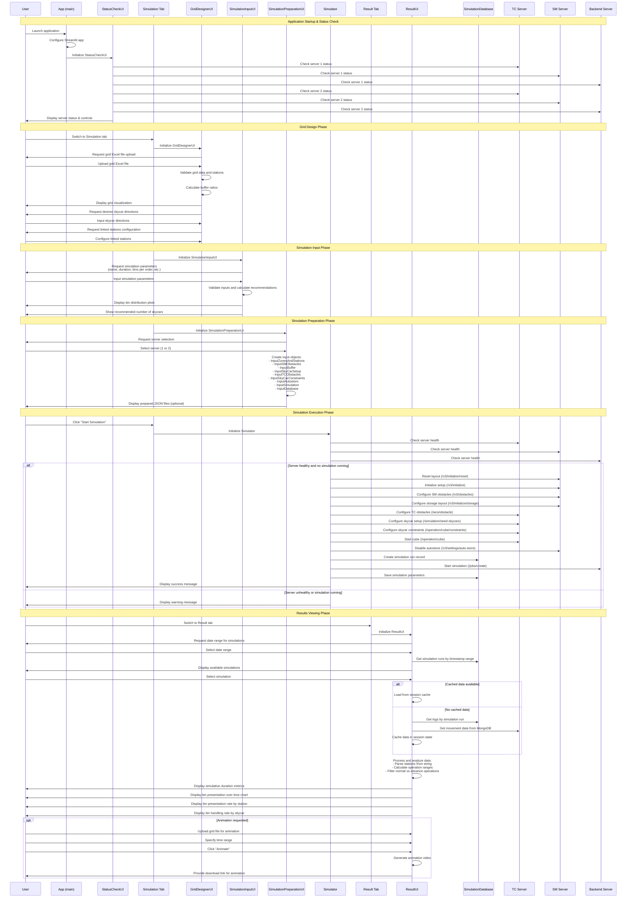

# Frontend Process Flow - Sequence Diagram

This diagram shows the complete process flow of the frontend application, from startup to simulation execution and results viewing.

## Mermaid Sequence Diagram

## Process Overview

The frontend application follows a structured workflow:

### 1. Application Startup & Status Check
- Streamlit app initialization
- Server health checks for TC, SM, and Backend servers
- Status display and control interface

### 2. Grid Design Phase
- Grid Excel file upload and validation
- Station configuration and validation
- Skycar direction preferences
- Linked station setup

### 3. Simulation Input Phase
- Simulation parameter configuration
- Bin distribution setup using Pareto distribution
- Skycar count recommendations
- Input validation and visualization

### 4. Simulation Preparation Phase
- Server selection (1 or 2)
- Creation of input objects for all simulation components
- JSON configuration file preparation

### 5. Simulation Execution Phase
- Health checks and conflict detection
- Sequential API calls to configure servers:
  - SM (Storage Manager) configuration
  - TC (Traffic Controller) setup
  - Backend simulation initiation
- Database record creation

### 6. Results Viewing Phase
- Simulation run selection
- Data retrieval and caching
- Comprehensive analytics and visualization
- Optional animation generation

## Components

- **GridDesignerUI**: Grid layout design and validation
- **SimulationInputUI**: Parameter input and validation
- **SimulationPreparationUI**: Configuration preparation
- **Simulator**: Orchestrates simulation startup
- **ResultUI**: Results analysis and visualization
- **StatusCheckUI**: Server monitoring and control

## External Systems

- **TC Server**: Traffic control and skycar management
- **SM Server**: Storage management
- **Backend Server**: Simulation execution engine
- **SimulationDatabase**: Local data persistence
- **MongoDB**: Movement data storage
